Hi 👋 I build AI agents that do real work on messy data. By day that means multi-agent systems, knowledge graphs and MCP servers running in production for enterprises. On my own time I pick a job people still do by hand, build the smallest version that works, measure it honestly and publish the code, including the numbers that came out badly.

## 🛰️ Right now: teaching an agent to map roads

**[gis-agent](https://github.com/blessondavis/gis-agent)** hands a region of satellite imagery to an LLM agent. The agent drives SAM 3 or a trained U-Net plus headless QGIS through **23 MCP tools**. It scores its own output, re-runs the areas it got wrong, and returns a noded road network as GeoJSON.

| 🗺️ Boston, 3 × 3 km | 🌍 Cities it had never seen | 🧭 Without labels | ✍️ With a person |
| :---: | :---: | :---: | :---: |
| 2,125 centrelines at **relaxed F1 0.79** | roads found **21% → 54%** after 10 minutes of fine-tuning | a confidence-based judge picked the ground-truth winner every time | an in-map editor whose edits survive every re-run |

## 🏗️ What I build at work

Four years at **[Minfy Technologies](https://www.minfytech.com/)**, shipping AI systems on AWS, GCP and Azure:

| system | built with | result |
| --- | --- | --- |
| **Agentic legacy modernization** for 140+ apps across 500+ repos (COBOL → Java) | code-to-knowledge-graph pipeline, custom Neptune MCP server, agent skills, EKS | graph queries **45% faster**, manual code reading **60% lower** |
| **Operational-resilience knowledge graph** built by LLMs from business-impact documents | Bedrock, LangGraph, FalkorDB, FastAPI, Dapr | assessment turnaround **85% faster** |
| **Multi-agent complaint resolution** that triages, routes and quality-checks email | Google ADK, Outlook MCP servers, GCP | manual effort **70% lower** |
| **Clinical documentation**: live transcription to SOAP notes and referral letters | speech-to-text, LLMs, a doctor in the loop | documentation work **80% lower** |
| **Generative virtual try-on** for full-body garments | fine-tuned IDM-VTON, SDXL inpainting, AWS | **87%** garment alignment |

## 🔨 Recently shipped

<!-- recent_commits starts -->
- [Show the Traverse name in the banner, screenshots and web header](https://github.com/blessondavis/gis-agent/commit/57051b8a45acf14ae49f21e18efc131b2bbdf8c5) · [gis-agent](https://github.com/blessondavis/gis-agent) · 14 Sep 2026
- [Rebuild the harness as middleware and name it Traverse](https://github.com/blessondavis/gis-agent/commit/4e0eeb1c29f0dcb3fc70e4707616f07c09d5e57a) · [gis-agent](https://github.com/blessondavis/gis-agent) · 14 Sep 2026
- [Add gameplay GIF and kill gallery to README; soft-target AWR option](https://github.com/blessondavis/classical-DOOM/commit/333b42fd06b0c6ea06a86a5c7de515274f0bf505) · [classical-DOOM](https://github.com/blessondavis/classical-DOOM) · 11 Sep 2026
- [XGBoost vs SauerkrautLM-Doom-MultiVec on ViZDoom defend_the_center](https://github.com/blessondavis/classical-DOOM/commit/c483cc7144280aee4ecc8743db00c2388434122b) · [classical-DOOM](https://github.com/blessondavis/classical-DOOM) · 11 Sep 2026
- [Initial commit](https://github.com/blessondavis/classical-DOOM/commit/b95d4cfd72524c035849c616b5aab90e085c0455) · [classical-DOOM](https://github.com/blessondavis/classical-DOOM) · 11 Sep 2026
<!-- recent_commits ends -->

Updated daily by a [GitHub Action](.github/workflows/update-readme.yml).

## 🧰 What I reach for

Plus **LangGraph · Google ADK · MCP · Bedrock · Vertex AI · Neo4j · FalkorDB · Neptune · QGIS · SAM 3**, and whichever graph database wins the benchmark.

## 👤 A bit about me

- 🎓 Postgraduate in AI and Data Science from **Plaksha University** (in partnership with UC Berkeley), after a mechanical engineering degree from **IIITD&M Kancheepuram**
- 🌱 GIS isn't new to me. Before Minfy I built geospatial ML for a Berlin agritech startup, choosing where to grow avocados and olives from multi-terabyte GIS and weather data.
- 🔧 My favourite problem right now is making agents **reliable**: evals, budgets, stop conditions, and the other unglamorous parts that decide whether an agent can run unattended.

<b>More on my GitHub</b>

 

| project | what it is |
| --- | --- |
| [shopping-agent](https://github.com/blessondavis/shopping-agent) | A ReAct / chain-of-tools shopping agent with smolagents and Claude on Amazon Bedrock |
| [optimize-pytorch-models-using-awsneuronsdk](https://github.com/blessondavis/optimize-pytorch-models-using-awsneuronsdk) | Compiling a Hugging Face BERT with the AWS Neuron SDK and serving it on Inferentia through SageMaker |
| [all-about-LLMs](https://github.com/blessondavis/all-about-LLMs) | Notebooks exploring what you can build on top of foundation models |
| [Artifical-Intelligence](https://github.com/blessondavis/Artifical-Intelligence) · [Natural-Language-Processing](https://github.com/blessondavis/Natural-Language-Processing) | Where it started: ML, DL and NLP projects |

---

If you're working on agents, knowledge graphs or geospatial AI, say hi on [X](https://x.com/BlessonDavis). Or clone [gis-agent](https://github.com/blessondavis/gis-agent) and point it at a city it has never seen. That's usually the fun part.
